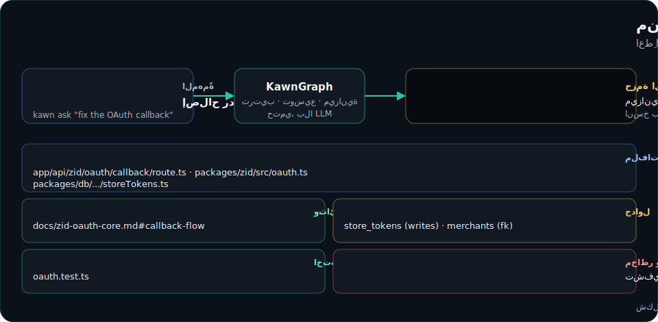
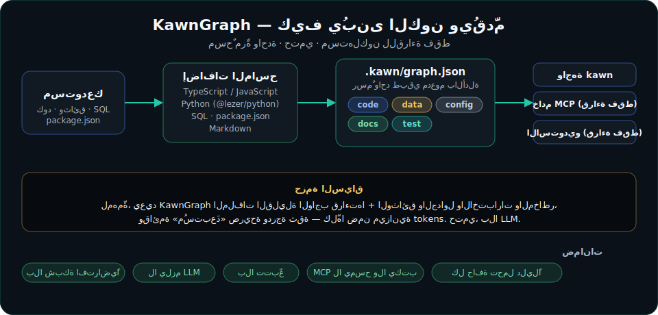

<!-- KAWN-TRANSLATION
lang: ar
status: ai-assisted
canonical: README.md
canonical-sha: fa965807adf98799984ab7bd27028a428bac7355a8bf9ef878d0b0254a71fb90
-->

<div dir="rtl" align="center">

<picture>
  <source media="(prefers-color-scheme: dark)" srcset="brand/logo-dark.svg">
  <source media="(prefers-color-scheme: light)" srcset="brand/logo-light.svg">
  
</picture>

### كون السياق للوكلاء

**كونٌ واحد للمشروع. لكل وكيل برمجة.**

يحوّل KawnGraph الكودَ والوثائق والبيانات والاختبارات وتغييرات Git إلى **حِزَم
سياق** مدعومة بالأدلة، حتى يصل Claude وCodex وCursor إلى الملفات الصحيحة دون قراءة
المستودع بأكمله.

<!-- LANGBAR:START -->

[English](README.md) ·
**العربية** ·
[Español](docs/i18n/README.es.md) ·
[Français](docs/i18n/README.fr.md) ·
[Deutsch](docs/i18n/README.de.md) ·
[Português (BR)](docs/i18n/README.pt-BR.md) ·
[简体中文](docs/i18n/README.zh-CN.md) ·
[繁體中文](docs/i18n/README.zh-TW.md) ·
[日本語](docs/i18n/README.ja.md) ·
[한국어](docs/i18n/README.ko.md) ·
[हिन्दी](docs/i18n/README.hi.md) ·
[Bahasa Indonesia](docs/i18n/README.id.md) ·
[Türkçe](docs/i18n/README.tr.md) ·
[Русский](docs/i18n/README.ru.md) ·
[Italiano](docs/i18n/README.it.md) ·
[فارسی](docs/i18n/README.fa.md) ·
[اردو](docs/i18n/README.ur.md) ·
[Polski](docs/i18n/README.pl.md) ·
[Nederlands](docs/i18n/README.nl.md) ·
[Українська](docs/i18n/README.uk.md) ·
[Tiếng Việt](docs/i18n/README.vi.md) ·
[ภาษาไทย](docs/i18n/README.th.md) ·
[Svenska](docs/i18n/README.sv.md) ·
[Ελληνικά](docs/i18n/README.el.md) ·
[Română](docs/i18n/README.ro.md) ·
[Čeština](docs/i18n/README.cs.md) ·
[Suomi](docs/i18n/README.fi.md) ·
[Dansk](docs/i18n/README.da.md) ·
[Norsk](docs/i18n/README.no.md) ·
[Magyar](docs/i18n/README.hu.md) ·
[עברית](docs/i18n/README.he.md)

<sub>English is canonical · العربية is AI-assisted · owner review pending · the other 29 languages are machine-assisted (human review needed) — see [translation status](docs/i18n/STATUS.md).</sub>

<!-- LANGBAR:END -->

[](https://xd7fx.github.io/kawngraph-site/)
[](https://www.npmjs.com/package/kawngraph)
[](LICENSE)
[](package.json)
[](docs/PRIVACY.md)
[](docs/PRIVACY.md)
[](SUPPORT.md)
[](https://www.linkedin.com/in/abdulrahman-alnashri-ai/)
[](https://github.com/sponsors/xd7fx)

</div>

<div dir="rtl">

---

<div align="center">

</div>

---

## لماذا KawnGraph؟

حين تُسنِد مهمّةً إلى وكيل برمجة، فإنه عادةً يبدأ بـ*القراءة* — كثيرًا. يفتح عشرات
الملفات، ويعيد استنتاج كيف تصل المسارات إلى قاعدة البيانات، ويبني النموذج الذهني
نفسه في كل طلب. هذا بطيء، ومكلّف بالـtokens، وغالبًا غير دقيق: يفوته الملف الوحيد
المهم ويغرق في خمسة ملفات لا تهم.

يمسح KawnGraph المستودع **مرّةً واحدة**، ويبني رسمًا بيانيًا طبقيًا مدعومًا بالأدلة
لكيفية ترابط الأشياء، ثم يجيب — لمهمّة محدّدة — بـ**الملفات القليلة المهمّة**،
إضافةً إلى الوثائق ذات الصلة، وجداول قاعدة البيانات المرتبطة، والاختبارات التي
يجب تشغيلها، والمخاطر التي يجب الانتباه لها. هذه الحزمة هي **حزمة السياق**. الرسم
البياني هو الأساس؛ وحزمة السياق هي المنتج.

> **اعطِ الوكيل الخريطة، لا المشروع كاملًا.**

---

## البدء السريع

ثبِّت وشغّل KawnGraph بأمرٍ **واحد** — يجلبه `npx`، بلا حاجة لاستنساخ المستودع
(Node ≥ 18):

```bash
npx kawngraph setup   # scan, detect your agents, connect them, verify retrieval
kawn check            # health: is the graph fresh? who is connected?
kawn map              # open the local, read-only visual explorer
```

**أو من المصدر** (هذا المستودع، للمساهمين — مع [pnpm](https://pnpm.io)):

```bash
pnpm install && pnpm build          # build the workspace
pnpm kawn setup --agent all --yes   # scan + connect Claude Code / Codex / Cursor
pnpm kawn check                     # is the graph fresh? who is connected?
pnpm studio:build && pnpm kawn map  # open the read-only visual explorer
```

ثم افتح وكيلك واكتب وصف مهمّتك فحسب — سيسحب الملفات القليلة المهمّة من تلقاء نفسه.
بلا مفاتيح API، بلا تتبّع، بلا أي اتصال بالشبكة أثناء المسح أو الاسترجاع. جديد على
الأداة؟ ابدأ من **[docs/GETTING_STARTED.md](docs/GETTING_STARTED.md)**.

---

## اربطه بوكيل البرمجة لديك

جوهر KawnGraph أن يصل الوكيل إلى الخريطة **تلقائيًا**. أمرٌ واحد يربط المشروع
بالوكلاء الذين تستخدمهم — دون تعديل `CLAUDE.md` أو `AGENTS.md`، وكل تغيير قابل
للتراجع:

```bash
kawn setup                  # scan if needed, detect agents, connect, verify
kawn setup --agent all --yes   # non-interactive (CI), every supported agent
kawn setup --dry-run        # preview the exact file changes, write nothing
kawn status                 # is the graph fresh? who is connected?
kawn disconnect codex       # cleanly remove only KawnGraph's entry
```

يكتشف `setup` وكلاءك البرمجيين — **Claude Code** و**Codex** و**Cursor**
و**Copilot** و**Gemini CLI** و**Aider** (إضافةً إلى تصدير `generic` بصيغة
Markdown/JSON ونموذج لغوي محلي اختياري) — ويثبّت **تكاملًا للقراءة فقط** محصورًا
بالمشروع (`.mcp.json` أو `.cursor/mcp.json` أو `.codex/config.toml` أو
`.vscode/mcp.json` أو `.gemini/settings.json` أو ملف سياق لـ Aider)، مع أخذ نسخة
احتياطية لأي ملف يمسّه والتحقق من كل خادم MCP بمصافحةٍ حيّة. العقد الكامل في
**[docs/AGENT_INTEGRATION.md](docs/AGENT_INTEGRATION.md)**.

**خادم MCP** هو حلقة stdio JSON-RPC للقراءة فقط، **بلا حزمة MCP SDK** (مكتوبة يدويًا)، وبأربع أدوات:

| الأداة | ما تفعله |
| ---- | ------------ |
| `kawn_context` | حزمة سياق محدودة الميزانية لمهمّة. |
| `kawn_query` | بحث مرتّب ومحصور بالنمط فوق الرسم البياني. |
| `kawn_affected` | الأثر العكسي: ما الذي يعتمد على رمزٍ ما. |
| `kawn_changes` | أثر مجموعة التغييرات الحالية (غير المُودَعة، أو فرع مقابل مرجع أساس). git محلي فقط. |

الخادم **يقرأ فقط** الرسم البياني — لا يمسح ولا يعيد البناء ولا يكتب (وينبّه حين يبدو
الرسم قديمًا ويشير إلى `kawn update`).

---

## كيف يعمل

المشروع ليس كودًا فقط. إنه كودٌ **و**وثائق **و**SQL **و**اختبارات **و**الإعدادات
التي تربطها. يُمثّل KawnGraph كلًّا منها بوصفه **طبقة** مستقلّة، فيطلب الاستعلام ما
يحتاجه بالضبط ولا شيء سواه — استعلام أثر الكود لا يجرّ وثائق التسويق؛ واستعلام
الوثائق لا يعيد رسوم النداء الخام إلا إذا طلبتها.

<div align="center">

</div>

| الطبقة | أمثلة |
| -------- | --------------------------------------------------- |
| `code`   | ملفات، دوال، أصناف، استيرادات، نداءات، مسارات |
| `data`   | جداول SQL، هجرات، مفاتيح أجنبية |
| `config` | حِزَم مساحة العمل، الاعتماديات |
| `docs`   | أقسام markdown، روابط، إشارات |
| `test`   | الاختبارات وما تغطّيه |

تحمل الحواف **دليلًا** (مسار المصدر، مدى الأسطر، مقتطف) ودرجة ثقة — مُستنتَجًا
آليًا حيث يستطيع الماسح إرفاقه؛ ولكل عقدة
**مُعرّف ثابت قابل للعنونة بالمحتوى** كي يبقى الرسم قابلًا للمقارنة بين عمليات
المسح. النموذج الأعمق في **[docs/GRAPH_MODEL.md](docs/GRAPH_MODEL.md)**.

### حزمة سياق، من البداية إلى النهاية

```text
$ kawn ask "fix the Zid OAuth callback that writes store tokens"

Must-read
  app/api/zid/oauth/callback/route.ts     entry route
  packages/zid/src/oauth.ts               token exchange
  packages/db/.../storeTokens.ts          writes store_tokens
Docs
  docs/zid-oauth-core.md#callback-flow     expected behaviour
Tables
  store_tokens (written) · merchants (fk)
Tests        oauth.test.ts
Risks        token encryption · tenant isolation
Excluded     unrelated UI components (over budget)   ·   confidence 0.6
```

تتوفّر الحزمة نفسها بصيغة Markdown أو JSON أو **بروتوكول السياق الموحّد** المحايد
للوكلاء (`--format ucp` / `ucp-md`). المزيد في **[docs/CONTEXT_PACKS.md](docs/CONTEXT_PACKS.md)**.

---

## الاستوديو

يفتح `kawn map` **استوديو KawnGraph** — مستكشفًا محليًا **للقراءة فقط** يُقدَّم عبر
`127.0.0.1` يقرأ ملف `.kawn/graph.json` الموجود ولا يمسح ولا يعيد البناء ولا يكتب.
يوفّر رسمًا بيانيًا تفاعليًا ثنائي الأبعاد، وخريطة نجوم «كونية» ثلاثية الأبعاد قابلة
للتوسّع (محدودة الميزانية كي لا ترسم رسمًا كبيرًا كاملًا دفعةً واحدة)، وبانيَ حِزَم
سياق، والأثر العكسي، وعروض تغييرات Git، وعرضًا لقياس الأداء السلوكي. مبنيّ
بالإنجليزية والعربية (مع دعم الكتابة من اليمين لليسار). شغّله من المصدر بـ
`pnpm studio:build && pnpm kawn map`.

<div align="center">

<br><sub>عرض <b>الكون</b> ثلاثي الأبعاد — رسم هذا المستودع نفسه (1,261 عقدة)، للقراءة فقط.</sub>
</div>

<div align="center">

<br><sub>خريطة <b>الكوكبة ثنائية الأبعاد</b> — خريطة نجوم موجّهة بالقوى للرسم البياني (عقد ملوّنة حسب الطبقة، بحجم حسب الارتباط)، مع مرشّحات وبحث وتمرير وتكبير.</sub>
</div>

---

## KawnGraph مقابل البحث العادي في المستودع

مقارنة محايدة لـ*المقاربات* (ليست هجومًا على منافس). كل خانة قابلة للدفاع عنها؛
و«يختلف» تعني أنها تعتمد على الأداة المحدّدة.

| القدرة | بحث عادي | RAG عام | عارض رسم عام | **KawnGraph** |
| --- | :---: | :---: | :---: | :---: |
| مسح محلي حتمي | ✅ | يختلف | ✅ | ✅ |
| علاقات على مستوى الرموز | ❌ | يختلف | ✅ | ✅ |
| طبقات docs / data / test | ❌ | يختلف | يختلف | ✅ |
| دليل على الحواف | ❌ | ❌ | يختلف | ✅ |
| تحليل أثر محدود | ❌ | ❌ | يختلف | ✅ |
| سياق تغييرات Git | يختلف | ❌ | ❌ | ✅ |
| حِزَم سياق محدودة الميزانية | ❌ | يختلف | ❌ | ✅ |
| استرجاع MCP للقراءة فقط | ❌ | يختلف | يختلف | ✅ |
| لا يتطلّب LLM داخليًا | ✅ | ❌ | ✅ | ✅ |

مقارنة مؤرّخة وموثّقة المصادر بثلاثة أعمدة مع أداة رسم ناضجة (القدرات التي يتقدّم
فيها KawnGraph **و**التي لا يتقدّم فيها) موجودة في **[docs/COMPARISON.md](docs/COMPARISON.md)**.

---

## القياسات

يأتي KawnGraph مع **مِعمار A/B محلي** يشغّل *الوكيل نفسه* على *المهمّة نفسها*
**مع KawnGraph وبدونه** ويسجّل السلوك. النتائج صادقة و**تعتمد على المهمّة** —
بما في ذلك الحالات المحايدة والسلبية.

<!-- BENCH:START -->

<!-- Generated by scripts/readme-benchmark.mjs from benchmarks/published/campaign-2026-06-20.summary.json — do not edit by hand. -->

مِعمار A/B محلي: شُغِّلت 72 جلسة، منها 60 صالحة عبر 10 خلايا مهام، seed 1، 3 تكرارات لكل ذراع (3/ذراع بعد التجميع — **استكشافي، n<5، توجيهي فقط**). نفس الوكيل، ونفس المهمّة، ونفس لقطة المستودع؛ A = بدون KawnGraph، B = معه. Δ = B − A. استُبعدت 12 من 72 جلسة لأسباب تتعلّق بأصل المرجع الذهبي (انظر الأثر). التحقّق من المرجع الذهبي: جميع الجلسات المُحتفَظ بها لها مرجع ذهبي صالح.

**المهمّة الرئيسية — `zid-oauth` (retrieval) على `nextjs-supabase`:**

*Claude Code — نفس المهمّة، نفس المستودع، نفس النموذج (النموذج غير مثبّت في الأثر):*

| المقياس | بدون KawnGraph | مع KawnGraph | الفرق |
| --- | --- | --- | --- |
| صحة المهمّة | 100% | 100% | 0 pp |
| استدعاء KawnGraph تلقائيًا | 0% | 100% | +100 pp |
| الملفات ذات الصلة المُكتشَفة (recall) | 100% | 93% | -7 pp |
| دقّة الملفات المفتوحة (precision) | 83% | 89% | +6 pp |
| عدد الملفات المفتوحة المتمايزة | 6 | 5.3 | -0.7 |
| عدد نداءات الأدوات | 8.3 | 8.7 | +0.3 |
| الزمن حتى أول ملف ذي صلة | 20.7 s | 22.4 s | +1.7 s |
| الزمن الكلي (wall) | 54.6 s | 61.9 s | +7.3 s |
| tokens الخرج | 2,867 | 3,130 | +262 |

*Codex — نفس المهمّة، نفس المستودع، نفس النموذج (النموذج غير مثبّت في الأثر):*

| المقياس | بدون KawnGraph | مع KawnGraph | الفرق |
| --- | --- | --- | --- |
| صحة المهمّة | 100% | 100% | 0 pp |
| استدعاء KawnGraph تلقائيًا | 0% | 0% | 0 pp |
| الملفات ذات الصلة المُكتشَفة (recall) | 80% | 87% | +7 pp |
| دقّة الملفات المفتوحة (precision) | 25% | 61% | +36 pp |
| عدد الملفات المفتوحة المتمايزة | 1 | 4.3 | +3.3 |
| عدد نداءات الأدوات | 2.7 | 8 | +5.3 |
| الزمن حتى أول ملف ذي صلة | 18.7 s | 17.8 s | -884 ms |
| الزمن الكلي (wall) | 36.4 s | 41 s | +4.5 s |
| tokens الخرج | 822 | 1,082 | +260 |

> KawnGraph يعتمد على المهمّة. قد يقلّل استكشاف المستودع في الأعمال متعددة الملفات غير المألوفة، بينما يضيف عبئًا على المهام المركّزة أصلًا. انظر المنهجية الكاملة والقيود في [docs/BENCHMARKS.md](docs/BENCHMARKS.md).

**أين ساعد، وأين كان محايدًا، وأين أضرّ (كل الـ10 خلايا مهام):**

| عائلة المهمّة | الوكيل | النمط | النتيجة | Δ نداءات الأدوات | Δ الزمن |
| --- | --- | --- | --- | --- | --- |
| context-pack-ranking | claude | retrieval | محايد | -0.3 | +6.2 s |
| docs-to-code-linking | claude | retrieval | محايد | -0.3 | +9.6 s |
| freshness-gate | claude | retrieval | محسّن | -9.7 | -54.6 s |
| oauth-code-guard | claude | e2e | محايد | -0.3 | +5.9 s |
| zid-oauth | claude | retrieval | متراجع | +0.3 | +7.3 s |
| context-pack-ranking | codex | retrieval | متراجع | +4 | +33.3 s |
| docs-to-code-linking | codex | retrieval | محسّن | -0.7 | -4.6 s |
| freshness-gate | codex | retrieval | محايد | 0 | -2.1 s |
| oauth-code-guard | codex | e2e | متراجع | 0 | +1.5 s |
| zid-oauth | codex | retrieval | متراجع | +5.3 | +4.5 s |

تُشتقّ تسميات النتيجة (`Improved` محسّن / `Neutral` محايد / `Regressed` متراجع / `Insufficient data` بيانات غير كافية) حتميًا من فروق نداءات الأدوات والزمن؛ وكل خلية n=3/ذراع، فجميعها توجيهية. الجداول الكاملة لكل مقياس: [benchmarks/published/campaign-2026-06-20.md](benchmarks/published/campaign-2026-06-20.md).

<!-- BENCH:END -->

المنهجية والبيئة وأحجام العيّنات والجداول التفصيلية والقيود في
**[docs/BENCHMARKS.md](docs/BENCHMARKS.md)** — مُولَّدة من الأثر المُتحقَّق منه
والمُودَع في [`benchmarks/published/`](benchmarks/published/).

---

## الماسحات والطبقات المدعومة

كل لغة/صيغة هي **إضافة ماسح** مُؤرَّخة الإصدار خلف سجلٍّ واحد (اكتشاف ← مسح ←
إنهاء): ترتيب حتمي، وعزل أعطال لكل ملف، وتسجيل صريح، وأحجام ملفات محدودة.

| اللغة / الصيغة | المُستخرَج |
| ----------------- | --------- |
| TypeScript / JS   | ملفات، دوال/أصناف عُليا، استيرادات، نداءات، مسارات Next.js، اختبارات |
| Python            | `def`/`async def`/`class` العُليا، المُزيِّنات، التوابع (كبيانات وصفية)، الاستيرادات، مسارات FastAPI/Flask، docstrings، اختبارات (عبر `@lezer/python` — JS صرف، متسامح مع الأخطاء) |
| SQL               | جداول (`CREATE`/`ALTER`)، علاقات المفاتيح الأجنبية |
| package.json      | حِزَم مساحة العمل والاعتماديات الداخلية |
| Markdown          | عناوين/أقسام مرتبطة بالكود وSQL والمسارات |

إغفالان متعمّدان في ماسحَي الكود: التوابع/الدوال المتداخلة ليست عقدًا مستقلّة أبدًا
(التابع يركب على صنفه كبيانات وصفية)، وملفات التصريح المُجرّدة (`.d.ts`، `.pyi`) لا
تُدّعى أبدًا. التفاصيل في **[docs/SCANNERS.md](docs/SCANNERS.md)**.

---

## الخصوصية والأمان

- **بلا شبكة افتراضيًا.** المسح والاسترجاع يقرآن مستودعك ويكتبان JSON تحت `.kawn/`.
  لا شيء يغادر الجهاز.
- **بلا LLM داخلي.** الكود والوثائق وSQL تُحلَّل بنيويًا؛ والإثراء بالذكاء الاصطناعي
  اختياري ومحلي أولًا.
- **بلا تتبّع. بلا تسجيل للاستعلامات افتراضيًا.**
- **MCP للقراءة فقط.** الخادم يقدّم الرسم؛ ولا يمسح ولا يعيد البناء ولا يكتب —
  ويرفض تقديم رسمٍ لا يثق بمخطّطه.
- **تكاملات قابلة للتراجع ومحصورة بالمشروع.** كتابات ذرّية، ونسخ احتياطية مؤرّخة،
  وتعديلات إعدادات بنيوية (لا استبدال نصوص)؛ لا يعدّل `CLAUDE.md` / `AGENTS.md`،
  ولا يمسّ الإعداد العام افتراضيًا.

النموذج الكامل في **[docs/PRIVACY.md](docs/PRIVACY.md)**. أبلِغ عن ثغرة بسرّية عبر
**[SECURITY.md](SECURITY.md)**.

---

## الحالة والقيود

KawnGraph قيد **التطوير النشط** (`v0.1.0`، لم يُنشَر بعد على npm). مبنيّ ومُختبَر
من طرفٍ إلى طرف: رسم code/data/config/docs/test، وروابط الوثائق-إلى-الكود،
والاستعلام المحصور بالنمط، وتحليل الأثر، وأثر Git/PR، وحِزَم السياق محدودة
الميزانية، وبروتوكول السياق الموحّد، وخادم MCP للقراءة فقط، وإعداد الوكلاء بأمرٍ
واحد (Claude Code / Codex / Cursor)، والاستوديو، ومِعمار قياس A/B.

**قيود صادقة.** القياس المنشور **استكشافي (n<5 لكل ذراع — توجيهي، غير دالّ
إحصائيًا)**. يساعد KawnGraph أكثر في الاكتشاف متعدّد الملفات غير المألوف، وقد يضيف
عبئًا على المهام المركّزة على ملفٍ واحد. لم يُبنَ بعد: الخطّافات الاختيارية
المقترِحة فقط، وطبقة المرئيات، والإثراء الدلالي/الذكي، وطبقة وقت التشغيل — وكلّها
اختيارية بالتصميم. راجع [PROJECT_PLAN.md](PROJECT_PLAN.md) ·
[ARCHITECTURE.md](ARCHITECTURE.md) · [docs/FAQ.md](docs/FAQ.md) ·
[docs/TROUBLESHOOTING.md](docs/TROUBLESHOOTING.md).

---

## التوثيق

| الدليل | المحتوى |
| ----- | ------------- |
| [البدء](docs/GETTING_STARTED.md) | التثبيت والمسح وأول حزمة سياق |
| [تكامل الوكلاء](docs/AGENT_INTEGRATION.md) | عقد إعداد MCP وقابلية التراجع |
| [حِزَم السياق](docs/CONTEXT_PACKS.md) | الترتيب والميزانيات وصيغة UCP |
| [نموذج الرسم](docs/GRAPH_MODEL.md) | العقد والحواف والطبقات والأدلة والمُعرّفات |
| [الماسحات](docs/SCANNERS.md) | ما تستخرجه كل إضافة لغة |
| [القياسات](docs/BENCHMARKS.md) | المنهجية والبيئة والنتائج الكاملة |
| [المقارنة](docs/COMPARISON.md) | مقارنة قدرات مؤرّخة وموثّقة |
| [الخصوصية](docs/PRIVACY.md) | حدود البيانات لكل طبقة |
| [حلّ المشكلات](docs/TROUBLESHOOTING.md) · [الأسئلة الشائعة](docs/FAQ.md) | المشكلات والأسئلة الشائعة |

---

## المساهمة

المساهمات مُرحَّب بها. ابنِ من المصدر، شغّل المجموعة الاختبارية، واقرأ الدليل:

```bash
pnpm install && pnpm build
pnpm test            # node:test suite (graph, context, MCP, agents, Studio)
pnpm pack:check      # packaging audit (packs every package, installs from tarballs)
```

راجع **[CONTRIBUTING.md](CONTRIBUTING.md)** للإعداد والاصطلاحات ومراجعة الخصوصية
التي يمرّ بها كل طلب دمج؛ و**[CODE_OF_CONDUCT.md](CODE_OF_CONDUCT.md)** لتوقّعات
المجتمع؛ و**[docs/i18n/TRANSLATING.md](docs/i18n/TRANSLATING.md)** لإضافة لغة أو
مراجعتها؛ و**[SUPPORT.md](SUPPORT.md)** لمكان طرح الأسئلة.

---

## الرخصة والشكر

**[MIT](LICENSE)** © مساهمو KawnGraph.

أنشأه ويتعهّده **[عبدالرحمن النشري](https://www.linkedin.com/in/abdulrahman-alnashri-ai/)**.

**كَوْن** (بالعربية: *الكون، الوجود*) يعامل المستودع بوصفه كونًا حيًّا من المعرفة؛
و**Graph** هو رسم سياق الوكيل المدعوم بالأدلة في جوهره. مبنيّ بـ
[TypeScript](https://www.typescriptlang.org/) و[Vite](https://vitejs.dev/) و
[React](https://react.dev/) و[React Flow](https://reactflow.dev/) و
[Three.js](https://threejs.org/) و[`@lezer/python`](https://lezer.codemirror.net/).

</div>
