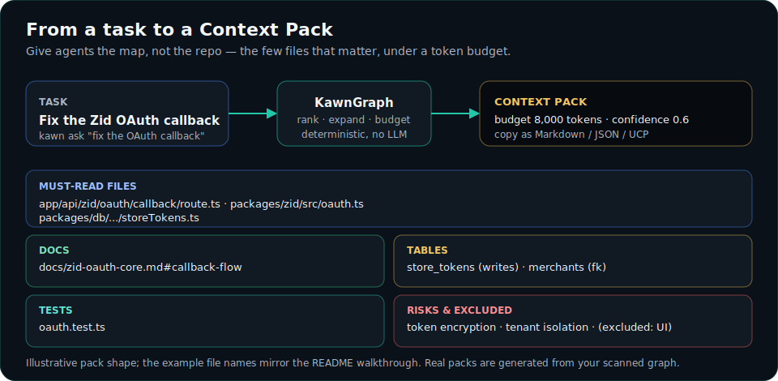
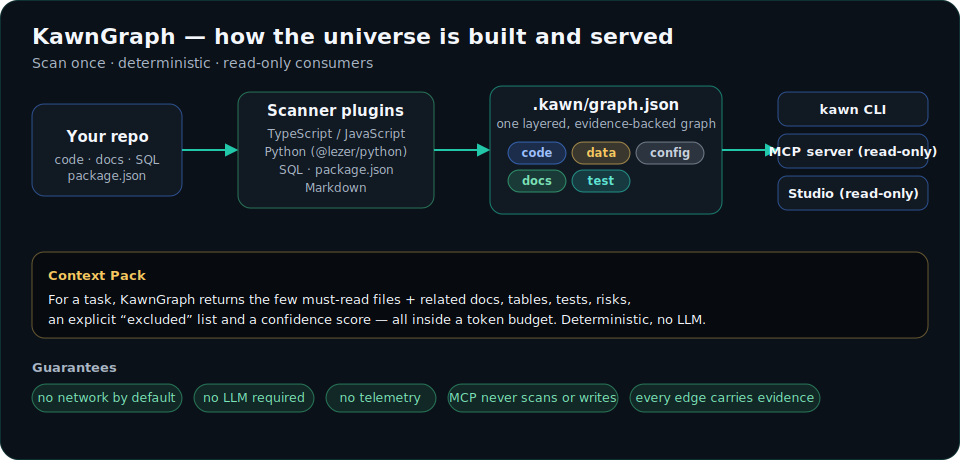

<!-- KAWN-TRANSLATION
lang: fr
status: machine-assisted
canonical: README.md
canonical-sha: 4ee6b7e69d4b76a495518d81d0f489290e0a9a198ba47984ed732e6cb691ea6c
-->

<div align="center">


### L'univers de contexte des agents

**Un seul univers de projet. Tous les agents de code.**

[English](../../README.md) · [العربية](../../README.ar.md) · [Français] (actuel) · [statut des traductions](STATUS.md)

> Cette traduction est **assistée par machine** et peut contenir des erreurs. La version anglaise canonique fait foi : [README.md](../../README.md). Voir [STATUS.md](STATUS.md).

</div>

---

KawnGraph cartographie le code, la documentation, les données, les tests et les
changements Git dans des **Context Packs** étayés par des preuves, afin que
Claude, Codex et Cursor puissent atteindre les bons fichiers sans lire
l'intégralité du dépôt.

<div align="center">

</div>

---

## Pourquoi KawnGraph ?

Quand vous confiez une tâche à un agent de code, il commence généralement par
*lire* — beaucoup. Il ouvre des dizaines de fichiers, reconstitue comment les
routes atteignent la base de données, et rebâtit le même modèle mental à chaque
requête. C'est lent, coûteux en tokens et souvent inexact : l'agent rate le seul
fichier qui compte et se noie dans cinq qui ne comptent pas.

KawnGraph analyse le dépôt **une seule fois**, construit un graphe en couches
étayé par des preuves de la manière dont les choses sont liées, puis répond, pour
une tâche précise, avec les **quelques fichiers qui comptent** — ainsi que la
documentation pertinente, les tables de base de données associées, les tests à
exécuter et les risques à surveiller. Cet ensemble est un **Context Pack**. Le
graphe est le substrat ; le Context Pack est le produit.

> **Give agents the map, not the repo.** — اعطِ الإيجنت الخريطة، مو المشروع كامل.

---

## Quick Start

> **À noter :** le paquet npm `kawngraph` n'est **pas encore publié**, donc
> `npx kawngraph …` n'est *pas* disponible aujourd'hui. Utilisez la voie depuis
> les sources ci-dessous ; le flux `npx` est présenté pour **après la publication**.

**Aujourd'hui — depuis les sources** (ce monorepo, Node ≥ 18 + [pnpm](https://pnpm.io)) :

```bash
pnpm install && pnpm build          # build the workspace
pnpm kawn setup --agent all --yes   # scan + connect Claude Code / Codex / Cursor
pnpm kawn check                     # is the graph fresh? who is connected?
pnpm studio:build && pnpm kawn map  # open the read-only visual explorer
```

**Après la publication npm** (l'expérience en une seule commande visée) :

```bash
npx kawngraph setup   # scan, detect your agents, connect them, verify retrieval
kawn check            # health: is the graph fresh? who is connected?
kawn map              # open the local, read-only visual explorer
```

Ouvrez ensuite votre agent et décrivez simplement votre tâche — il récupère les
quelques fichiers qui comptent, tout seul. Aucune clé d'API, aucune télémétrie,
aucun appel réseau pendant l'analyse ou la récupération. Vous débutez ? Commencez
par **[docs/GETTING_STARTED.md](../GETTING_STARTED.md)**.

---

## Connectez-le à votre agent de code

L'intérêt de KawnGraph est que l'agent recourt à la carte **automatiquement**.
Une seule commande relie un projet aux agents que vous utilisez — sans modifier
`CLAUDE.md` ni `AGENTS.md`, chaque changement étant réversible :

```bash
kawn setup                  # scan if needed, detect agents, connect, verify
kawn setup --agent all --yes   # non-interactive (CI), every supported agent
kawn setup --dry-run        # preview the exact file changes, write nothing
kawn status                 # is the graph fresh? who is connected?
kawn disconnect codex       # cleanly remove only KawnGraph's entry
```

`setup` détecte **Claude Code**, **Codex** et **Cursor** et installe une
**intégration MCP en lecture seule** limitée au projet (`.mcp.json`,
`.cursor/mcp.json` ou `.codex/config.toml`), en sauvegardant tout ce qu'il touche
et en vérifiant le serveur par une poignée de main en direct. Contrat complet :
**[docs/AGENT_INTEGRATION.md](../AGENT_INTEGRATION.md)**.

Le **serveur MCP** est un JSON-RPC stdio en lecture seule, sans aucune dépendance, avec quatre outils :

| Outil | Ce qu'il fait |
| ---- | ------------ |
| `kawn_context` | Context Pack à budget de tokens pour une tâche. |
| `kawn_query` | Recherche classée et limitée par mode sur le graphe. |
| `kawn_affected` | Impact inverse : ce qui dépend d'un symbole. |
| `kawn_changes` | Impact de l'ensemble de changements en cours (non validés, ou une branche par rapport à une réf de base). Git local uniquement. |

Il **lit uniquement** le graphe — il ne l'analyse jamais, ne le reconstruit
jamais, ne l'écrit jamais (il avertit lorsque le graphe semble périmé et renvoie
vers `kawn update`).

---

## How It Works

Un projet, ce n'est pas que du code. C'est du code **et** de la documentation
**et** du SQL **et** des tests **et** la configuration qui les relie. KawnGraph
modélise chacun comme une **couche** distincte, afin qu'une requête demande
exactement ce dont elle a besoin et rien de plus — une requête d'impact de code
n'attire jamais des documents marketing ; une requête de documentation ne renvoie
jamais des graphes d'appels bruts sauf si vous le demandez.

<div align="center">

</div>

| Couche    | Exemples                                            |
| -------- | --------------------------------------------------- |
| `code`   | fichiers, fonctions, classes, imports, appels, routes |
| `data`   | tables SQL, migrations, clés étrangères             |
| `config` | paquets du workspace, dépendances                   |
| `docs`   | sections markdown, liens, mentions                  |
| `test`   | tests et ce qu'ils couvrent                         |

Chaque arête porte des **preuves** (chemin source, plage de lignes, extrait) et
un niveau de confiance ; chaque nœud possède un **ID stable et adressable par
contenu**, afin que le graphe reste comparable d'une analyse à l'autre. Modèle
plus détaillé : **[docs/GRAPH_MODEL.md](../GRAPH_MODEL.md)**.

### A Context Pack, end to end

```text
$ kawn ask "fix the Zid OAuth callback that writes store tokens"

Must-read
  app/api/zid/oauth/callback/route.ts     entry route
  packages/zid/src/oauth.ts               token exchange
  packages/db/.../storeTokens.ts          writes store_tokens
Docs
  docs/zid-oauth-core.md#callback-flow     expected behaviour
Tables
  store_tokens (written) · merchants (fk)
Tests        oauth.test.ts
Risks        token encryption · tenant isolation
Excluded     unrelated UI components (over budget)   ·   confidence 0.6
```

Le même pack est disponible au format Markdown, JSON, ou via le **Universal
Context Protocol** agnostique aux agents (`--format ucp` / `ucp-md`). Plus :
**[docs/CONTEXT_PACKS.md](../CONTEXT_PACKS.md)**.

---

## Studio

`kawn map` ouvre **KawnGraph Studio** — un explorateur local en **lecture seule**
servi sur `127.0.0.1` qui lit le `.kawn/graph.json` existant et n'analyse jamais,
ne reconstruit jamais, n'écrit jamais. Il propose un graphe 2D interactif, une
carte stellaire 3D « Universe » à l'échelle (à budget, de sorte qu'elle ne dessine
jamais un grand graphe entier d'un coup), un constructeur de Context Pack,
l'impact inverse, des vues des changements Git et une vue de benchmark
comportemental. Conçu en anglais et en arabe (compatible RTL). Lancez-le depuis
les sources avec `pnpm studio:build && pnpm kawn map`.

> Une capture d'écran de Studio sera ajoutée à `docs/assets/` après la prochaine
> passe de capture visuelle ; d'ici là, les diagrammes ci-dessus sont les visuels
> canoniques.

---

## KawnGraph vs. la recherche brute dans un dépôt

Une comparaison neutre des *approches* (et non une attaque de concurrent). Chaque
cellule est défendable ; « varie » signifie que cela dépend de l'outil précis.

| Capacité | Recherche brute | RAG générique | Visualiseur de graphe générique | **KawnGraph** |
| --- | :---: | :---: | :---: | :---: |
| Analyse locale déterministe | ✅ | varie | ✅ | ✅ |
| Relations au niveau des symboles | ❌ | varie | ✅ | ✅ |
| Couches docs / data / test | ❌ | varie | varie | ✅ |
| Preuves sur chaque arête | ❌ | ❌ | varie | ✅ |
| Analyse d'impact bornée | ❌ | ❌ | varie | ✅ |
| Contexte des changements Git | varie | ❌ | ❌ | ✅ |
| Context Packs à budget de tokens | ❌ | varie | ❌ | ✅ |
| Récupération MCP en lecture seule | ❌ | varie | varie | ✅ |
| Aucun LLM interne requis | ✅ | ❌ | ✅ | ✅ |

Une comparaison datée, sourcée et en trois colonnes face à un outil de graphe
mature (les capacités sur lesquelles KawnGraph est en tête **et** celles où il ne
l'est pas) se trouve dans **[docs/COMPARISON.md](../COMPARISON.md)**.

---

## Benchmarks

KawnGraph fournit un **harnais A/B local** qui exécute le *même* agent sur la
*même* tâche **avec et sans** KawnGraph et enregistre le comportement. Les
résultats sont honnêtes et **dépendent de la tâche** — y compris les cas neutres
et négatifs.

<!-- BENCH:START -->

<!-- Generated by scripts/readme-benchmark.mjs from benchmarks/published/campaign-2026-06-20.summary.json — do not edit by hand. -->

Local A/B harness: 72 sessions run, 60 usable across 10 task cells, seed 1, 3 repeats per arm (3/arm after grouping — **exploratory, n<5, directional only**). Same agent, same task, same repository snapshot; A = without KawnGraph, B = with. Δ = B − A. 12 of 72 sessions were excluded for gold provenance (see the artifact). Gold validation: all retained runs have a valid gold reference.

**Headline task — `zid-oauth` (retrieval) on `nextjs-supabase`:**

*Claude Code — same task, same repository, same model (model not pinned in artifact):*

| Metric | Without KawnGraph | With KawnGraph | Difference |
| --- | --- | --- | --- |
| task correctness | 100% | 100% | 0 pp |
| automatic KawnGraph invocation | 0% | 100% | +100 pp |
| relevant files found (recall) | 100% | 93% | -7 pp |
| opened-file precision | 83% | 89% | +6 pp |
| distinct files opened | 6 | 5.3 | -0.7 |
| tool calls | 8.3 | 8.7 | +0.3 |
| time to first relevant file | 20.7 s | 22.4 s | +1.7 s |
| total wall time | 54.6 s | 61.9 s | +7.3 s |
| output tokens | 2,867 | 3,130 | +262 |

*Codex — same task, same repository, same model (model not pinned in artifact):*

| Metric | Without KawnGraph | With KawnGraph | Difference |
| --- | --- | --- | --- |
| task correctness | 100% | 100% | 0 pp |
| automatic KawnGraph invocation | 0% | 0% | 0 pp |
| relevant files found (recall) | 80% | 87% | +7 pp |
| opened-file precision | 25% | 61% | +36 pp |
| distinct files opened | 1 | 4.3 | +3.3 |
| tool calls | 2.7 | 8 | +5.3 |
| time to first relevant file | 18.7 s | 17.8 s | -884 ms |
| total wall time | 36.4 s | 41 s | +4.5 s |
| output tokens | 822 | 1,082 | +260 |

> KawnGraph is task-dependent. It can reduce repository exploration on unfamiliar multi-file work, while adding overhead on already-focused tasks. See the full methodology and limitations in [docs/BENCHMARKS.md](../BENCHMARKS.md).

**Where it helped, was neutral, or hurt (all 10 task cells):**

| Task family | Agent | Mode | Outcome | Tool-call Δ | Time Δ |
| --- | --- | --- | --- | --- | --- |
| context-pack-ranking | claude | retrieval | Neutral | -0.3 | +6.2 s |
| docs-to-code-linking | claude | retrieval | Neutral | -0.3 | +9.6 s |
| freshness-gate | claude | retrieval | Improved | -9.7 | -54.6 s |
| oauth-code-guard | claude | e2e | Neutral | -0.3 | +5.9 s |
| zid-oauth | claude | retrieval | Regressed | +0.3 | +7.3 s |
| context-pack-ranking | codex | retrieval | Regressed | +4 | +33.3 s |
| docs-to-code-linking | codex | retrieval | Improved | -0.7 | -4.6 s |
| freshness-gate | codex | retrieval | Neutral | 0 | -2.1 s |
| oauth-code-guard | codex | e2e | Regressed | 0 | +1.5 s |
| zid-oauth | codex | retrieval | Regressed | +5.3 | +4.5 s |

Outcome labels (`Improved` / `Neutral` / `Regressed` / `Insufficient data`) are derived deterministically from tool-call and wall-time deltas; every cell is n=3/arm, so all are directional. Full per-metric tables: [benchmarks/published/campaign-2026-06-20.md](../../benchmarks/published/campaign-2026-06-20.md).

<!-- BENCH:END -->

Méthodologie, environnement, tailles d'échantillon, tables par métrique et
limitations : **[docs/BENCHMARKS.md](../BENCHMARKS.md)** — généré à partir de
l'artefact validé et versionné dans [`benchmarks/published/`](../../benchmarks/published/).

---

## Scanners & couches pris en charge

Chaque langage/format est un **plugin de scanner** versionné derrière un registre
unique (détecter → analyser → finaliser) : ordre déterministe, isolation des
échecs par fichier, enregistrement explicite et tailles de fichier bornées.

| Langage / format | Extrait |
| ----------------- | --------- |
| TypeScript / JS   | fichiers, fonctions/classes de premier niveau, imports, appels, routes Next.js, tests |
| Python            | `def`/`async def`/`class` de premier niveau, décorateurs, méthodes (en métadonnées), imports, routes FastAPI/Flask, docstrings, tests (via `@lezer/python` — JS pur, tolérant aux erreurs) |
| SQL               | tables (`CREATE`/`ALTER`), relations de clés étrangères |
| package.json      | paquets du workspace et dépendances internes |
| Markdown          | titres/sections liés au code, au SQL et aux routes |

Deux omissions délibérées dans les deux scanners de code : les méthodes/fonctions
imbriquées ne sont jamais des nœuds distincts (une méthode est portée par sa
classe en métadonnées), et les fichiers de déclaration ambiante (`.d.ts`, `.pyi`)
ne sont jamais revendiqués. Détails : **[docs/SCANNERS.md](../SCANNERS.md)**.

---

## Confidentialité & sécurité

- **Aucun réseau par défaut.** L'analyse et la récupération lisent votre dépôt et
  écrivent du JSON sous `.kawn/`. Rien ne quitte la machine.
- **Aucun LLM interne.** Le code, la documentation et le SQL sont analysés
  structurellement ; l'enrichissement par IA est optionnel et local d'abord.
- **Aucune télémétrie. Aucune journalisation des requêtes par défaut.**
- **MCP en lecture seule.** Le serveur sert le graphe ; il ne l'analyse jamais,
  ne le reconstruit jamais, ne l'écrit jamais — et refuse de servir un graphe dont
  il ne peut pas faire confiance au schéma.
- **Intégrations réversibles, limitées au projet.** Écritures atomiques,
  sauvegardes horodatées, modifications de config structurées (et non textuelles) ;
  ne modifie jamais `CLAUDE.md` / `AGENTS.md`, ne touche jamais à la configuration
  globale par défaut.

Modèle complet : **[docs/PRIVACY.md](../PRIVACY.md)**. Signalez une vulnérabilité
en privé via **[SECURITY.md](../../SECURITY.md)**.

---

## Statut & limites

KawnGraph est en **développement actif** (`v0.1.0`, pas encore publié sur npm).
Construit et testé de bout en bout : le graphe code/data/config/docs/test, les
liens docs-vers-code, la requête limitée par mode, l'analyse d'impact, l'impact
Git/PR, les Context Packs à budget de tokens, le Universal Context Protocol, le
serveur MCP en lecture seule, la configuration des agents en une commande
(Claude Code / Codex / Cursor), Studio et le harnais de benchmark A/B.

**Limites honnêtes.** Le benchmark publié est **exploratoire (n<5 par bras —
directionnel, non significatif)**. KawnGraph aide le plus pour la découverte
multi-fichiers non familière et peut ajouter de la surcharge sur des tâches
mono-fichier déjà ciblées. Pas encore construit : les hooks optionnels en mode
suggestion seule, la couche visuelle, l'enrichissement sémantique/IA et une
couche d'exécution — tous optionnels par conception. Voir
[PROJECT_PLAN.md](../../PROJECT_PLAN.md) · [ARCHITECTURE.md](../../ARCHITECTURE.md) ·
[docs/FAQ.md](../FAQ.md) · [docs/TROUBLESHOOTING.md](../TROUBLESHOOTING.md).

---

## Documentation

| Guide | Contenu |
| ----- | ------------- |
| [Premiers pas](../GETTING_STARTED.md) | Installation, analyse, premier Context Pack |
| [Intégration des agents](../AGENT_INTEGRATION.md) | Contrat de configuration MCP, réversibilité |
| [Context Packs](../CONTEXT_PACKS.md) | Classement, budgets, format de transport UCP |
| [Modèle de graphe](../GRAPH_MODEL.md) | Nœuds, arêtes, couches, preuves, ID |
| [Scanners](../SCANNERS.md) | Ce que chaque plugin de langage extrait |
| [Benchmarks](../BENCHMARKS.md) | Méthodologie, environnement, résultats complets |
| [Comparaison](../COMPARISON.md) | Comparaison de capacités datée et sourcée |
| [Confidentialité](../PRIVACY.md) | Frontières des données par couche |
| [Dépannage](../TROUBLESHOOTING.md) · [FAQ](../FAQ.md) | Problèmes & questions courants |

---

## Contributing

Les contributions sont les bienvenues. Construisez depuis les sources, exécutez la
suite et lisez le guide :

```bash
pnpm install && pnpm build
pnpm test            # node:test suite (graph, context, MCP, agents, Studio)
pnpm pack:check      # packaging audit (packs every package, installs from tarballs)
```

Consultez **[CONTRIBUTING.md](../../CONTRIBUTING.md)** pour la configuration, les
conventions et la revue de confidentialité que passe chaque PR ;
**[CODE_OF_CONDUCT.md](../../CODE_OF_CONDUCT.md)** pour les attentes de la
communauté ; **[docs/i18n/TRANSLATING.md](TRANSLATING.md)** pour ajouter ou
réviser une langue ; et **[SUPPORT.md](../../SUPPORT.md)** pour savoir où poser
des questions.

---

## Licence & remerciements

**[MIT](../../LICENSE)** © contributeurs de KawnGraph.

**Kawn** (arabe **كَوْن** — *cosmos, univers, existence*) traite un dépôt comme un
univers vivant de connaissances ; **Graph** est le graphe de contexte d'agent
(Agent Context Graph) étayé par des preuves en son cœur. Construit avec
[TypeScript](https://www.typescriptlang.org/), [Vite](https://vitejs.dev/),
[React](https://react.dev/), [React Flow](https://reactflow.dev/),
[Three.js](https://threejs.org/) et
[`@lezer/python`](https://lezer.codemirror.net/).
