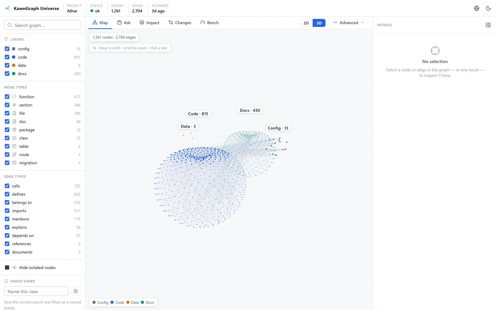
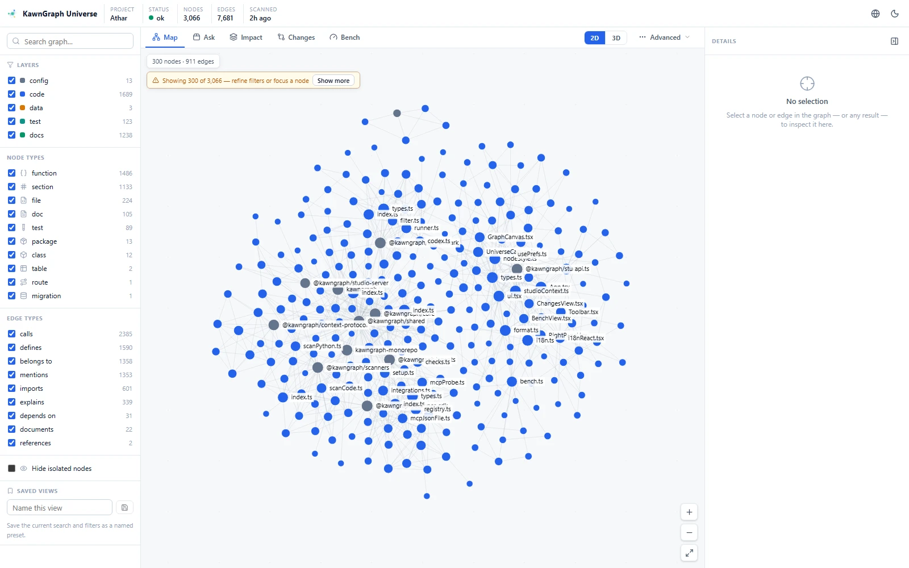

<!-- KAWN-TRANSLATION
lang: pl
status: machine-assisted
canonical: README.md
canonical-sha: eba313e4ecca3a6d315fe5d39edf1fb854167bc430af5f109c49db7effa99be9
-->

<div align="center">

<picture>
  <source media="(prefers-color-scheme: dark)" srcset="../../brand/logo-dark.svg">
  <source media="(prefers-color-scheme: light)" srcset="../../brand/logo-light.svg">
  
</picture>

### Wszechświat kontekstu dla agentów

**Jeden wszechświat projektu. Każdy agent programistyczny.**

KawnGraph odwzorowuje kod, dokumenty, dane, testy i zmiany w Git na oparte na dowodach
**Context Packi**, dzięki czemu Claude, Codex i Cursor mogą sięgnąć po właściwe pliki bez
czytania całego repozytorium.

[](../../LICENSE)
[](../../package.json)
[](../../tsconfig.base.json)
[](../PRIVACY.md)
[](../PRIVACY.md)
[](../../SUPPORT.md)
[](https://www.linkedin.com/in/abdulrahman-alnashri-ai/)

<!-- LANGBAR:START -->

[English](../../README.md) ·
[العربية](../../README.ar.md) ·
[Español](README.es.md) ·
[Français](README.fr.md) ·
[Deutsch](README.de.md) ·
[Português (BR)](README.pt-BR.md) ·
[简体中文](README.zh-CN.md) ·
[繁體中文](README.zh-TW.md) ·
[日本語](README.ja.md) ·
[한국어](README.ko.md) ·
[हिन्दी](README.hi.md) ·
[Bahasa Indonesia](README.id.md) ·
[Türkçe](README.tr.md) ·
[Русский](README.ru.md) ·
[Italiano](README.it.md) ·
[فارسی](README.fa.md) ·
[اردو](README.ur.md) ·
**Polski** ·
[Nederlands](README.nl.md) ·
[Українська](README.uk.md) ·
[Tiếng Việt](README.vi.md) ·
[ภาษาไทย](README.th.md) ·
[Svenska](README.sv.md) ·
[Ελληνικά](README.el.md) ·
[Română](README.ro.md) ·
[Čeština](README.cs.md) ·
[Suomi](README.fi.md) ·
[Dansk](README.da.md) ·
[Norsk](README.no.md) ·
[Magyar](README.hu.md) ·
[עברית](README.he.md)

<sub>English is canonical · العربية is AI-assisted · owner review pending · the other 29 languages are machine-assisted (human review needed) — see [translation status](STATUS.md).</sub>

<!-- LANGBAR:END -->

[](https://xd7fx.github.io/kawngraph-site/)
[](https://www.npmjs.com/package/kawngraph)
[](https://github.com/sponsors/xd7fx)

> To tłumaczenie jest wspomagane maszynowo i może zawierać błędy. Kanonicznym źródłem jest angielski plik [README.md](../../README.md); zobacz [STATUS.md](STATUS.md).

**[Szybki start](#szybki-start)** ·
**[Jak to działa](#jak-to-działa)** ·
**[Studio](#studio)** ·
**[Benchmarki](#benchmarki)** ·
**[Dokumentacja](#dokumentacja)** ·
**[Współtworzenie](#współtworzenie)**

</div>

---

<div align="center">

</div>

---

## Dlaczego KawnGraph?

Kiedy dajesz agentowi programistycznemu zadanie, zazwyczaj zaczyna on od *czytania* — i to dużo. Otwiera dziesiątki plików, na nowo odtwarza, jak trasy (routes) docierają do bazy danych, i przy każdym żądaniu buduje od zera ten sam model mentalny. To jest wolne, kosztowne tokenowo i często niedokładne: agent pomija ten jeden plik, który ma znaczenie, i tonie w pięciu, które go nie mają.

KawnGraph skanuje repozytorium **raz**, buduje warstwowy, oparty na dowodach graf tego, jak rzeczy są ze sobą powiązane, a następnie odpowiada — dla konkretnego zadania — wskazując **te kilka plików, które mają znaczenie** — wraz z istotnymi dokumentami, powiązanymi tabelami bazy danych, testami do uruchomienia i ryzykami, na które trzeba uważać. Ten zestaw to **Context Pack**. Graf jest podłożem; Context Pack jest produktem.

> **Daj agentom mapę, a nie całe repozytorium.** — اعطِ الإيجنت الخريطة، مو المشروع كامل.

---

## Szybki start

Zainstaluj i uruchom KawnGraph **jedną komendą** — `npx` go pobierze, niczego nie
trzeba klonować (Node ≥ 18):

```bash
npx kawngraph setup   # scan, detect your agents, connect them, verify retrieval
kawn check            # health: is the graph fresh? who is connected?
kawn map              # open the local, read-only visual explorer
```

**Lub ze źródeł** (to monorepo, dla współtwórców — [pnpm](https://pnpm.io)):

```bash
pnpm install && pnpm build          # build the workspace
pnpm kawn setup --agent all --yes   # scan + connect Claude Code / Codex / Cursor
pnpm kawn check                     # is the graph fresh? who is connected?
pnpm studio:build && pnpm kawn map  # open the read-only visual explorer
```

Następnie otwórz swojego agenta i po prostu opisz zadanie — sam pobierze te kilka plików, które mają znaczenie. Bez kluczy API, bez telemetrii, bez połączeń sieciowych podczas skanowania ani pobierania. Dopiero zaczynasz? Zacznij od **[docs/GETTING_STARTED.md](../GETTING_STARTED.md)**.

---

## Podłącz to do swojego agenta programistycznego

Sens KawnGraph polega na tym, że agent sięga po mapę **automatycznie**.
Jedna komenda łączy projekt z agentami, których używasz — bez edytowania `CLAUDE.md`
ani `AGENTS.md`, a każda zmiana jest odwracalna:

```bash
kawn setup                  # scan if needed, detect agents, connect, verify
kawn setup --agent all --yes   # non-interactive (CI), every supported agent
kawn setup --dry-run        # preview the exact file changes, write nothing
kawn status                 # is the graph fresh? who is connected?
kawn disconnect codex       # cleanly remove only KawnGraph's entry
```

`setup` wykrywa Twoich agentów programistycznych — **Claude Code**, **Codex**, **Cursor**,
**Copilot**, **Gemini CLI** oraz **Aider** (a także eksport `generic` w formacie Markdown/JSON
i opcjonalny **lokalny LLM**) — i instaluje **integrację tylko do odczytu** ograniczoną do
projektu (`.mcp.json`, `.cursor/mcp.json`, `.codex/config.toml`,
`.vscode/mcp.json`, `.gemini/settings.json` lub plik kontekstu Aider), tworząc kopię zapasową
wszystkiego, czego dotyka, i weryfikując każdy serwer MCP żywym uzgadnianiem (handshake). Pełny
kontrakt: **[docs/AGENT_INTEGRATION.md](../AGENT_INTEGRATION.md)**.

**Serwer MCP** to pętla JSON-RPC przez stdio, tylko do odczytu, **bez MCP SDK** (napisana ręcznie), z czterema narzędziami:

| Narzędzie | Co robi |
| ---- | ------------ |
| `kawn_context` | Context Pack z budżetem tokenów dla zadania. |
| `kawn_query` | Wyszukiwanie po grafie, rankingowane i ograniczone trybem. |
| `kawn_affected` | Odwrotny wpływ: co zależy od danego symbolu. |
| `kawn_changes` | Wpływ bieżącego zestawu zmian (niezacommitowane lub gałąź względem bazowej referencji). Tylko lokalny git. |

Serwer **tylko czyta** graf — nigdy go nie skanuje, nie przebudowuje ani nie zapisuje (ostrzega,
gdy graf wygląda na nieaktualny, i wskazuje na `kawn update`).

---

## Jak to działa

Projekt to nie tylko kod. To kod **oraz** dokumenty **oraz** SQL **oraz** testy
**oraz** konfiguracja, która je ze sobą wiąże. KawnGraph modeluje każdy z tych elementów jako
osobną **warstwę**, dzięki czemu zapytanie prosi dokładnie o to, czego potrzebuje, i o nic, czego nie
potrzebuje — zapytanie o wpływ na kod nigdy nie wciąga dokumentów marketingowych; zapytanie o dokumenty nigdy nie
zwraca surowych grafów wywołań, chyba że o to poprosisz.

<div align="center">

</div>

| Warstwa  | Przykłady                                            |
| -------- | --------------------------------------------------- |
| `code`   | pliki, funkcje, klasy, importy, wywołania, trasy    |
| `data`   | tabele SQL, migracje, klucze obce                   |
| `config` | pakiety workspace, zależności                       |
| `docs`   | sekcje markdown, linki, wzmianki                    |
| `test`   | testy i to, co pokrywają                            |

Każda krawędź niesie **dowód** (ścieżka źródłowa, zakres linii, fragment) oraz
poziom pewności — wyprowadzany mechanicznie tam, gdzie skaner może go dołączyć; każdy węzeł ma
**stabilny, adresowany treścią identyfikator (ID)**, dzięki czemu graf pozostaje porównywalny (diffable) między skanami.
Głębszy model:
**[docs/GRAPH_MODEL.md](../GRAPH_MODEL.md)**.

### Context Pack od początku do końca

```text
$ kawn ask "fix the Zid OAuth callback that writes store tokens"

Must-read
  app/api/zid/oauth/callback/route.ts     entry route
  packages/zid/src/oauth.ts               token exchange
  packages/db/.../storeTokens.ts          writes store_tokens
Docs
  docs/zid-oauth-core.md#callback-flow     expected behaviour
Tables
  store_tokens (written) · merchants (fk)
Tests        oauth.test.ts
Risks        token encryption · tenant isolation
Excluded     unrelated UI components (over budget)   ·   confidence 0.6
```

Ten sam pakiet jest dostępny jako Markdown, JSON lub neutralny względem agentów **Universal
Context Protocol** (`--format ucp` / `ucp-md`). Więcej:
**[docs/CONTEXT_PACKS.md](../CONTEXT_PACKS.md)**.

---

## Studio

`kawn map` otwiera **KawnGraph Studio** — lokalny eksplorator **tylko do odczytu** serwowany
przez `127.0.0.1`, który odczytuje istniejący `.kawn/graph.json` i nigdy nie skanuje,
nie przebudowuje ani nie zapisuje. Oferuje interaktywny graf 2D, skalowalną gwiezdną mapę 3D „Universe”
(z budżetem, dzięki czemu nigdy nie rysuje całego dużego grafu naraz), kreator Context Packów,
odwrotny wpływ, widoki zmian Git oraz widok testów behawioralnych (benchmark). Zbudowane
po angielsku i po arabsku (z obsługą RTL). Uruchom je ze źródeł poleceniem `pnpm studio:build &&
pnpm kawn map`.

<div align="center">

<br><sub>Widok 3D <b>Universe</b> — graf tego repozytorium (1 261 węzłów), tylko do odczytu.</sub>
</div>

<div align="center">

<br><sub>Widok <b>grafu</b> 2D — dołączony przykładowy projekt, z filtrami warstwa / typ / krawędź.</sub>
</div>

---

## KawnGraph kontra zwykłe wyszukiwanie w repozytorium

Neutralne porównanie *podejść* (nie atak na konkurencję). Każda komórka jest
obroniona; „varies” oznacza, że zależy to od konkretnego narzędzia.

| Możliwość | Zwykłe wyszukiwanie | Ogólny RAG | Ogólna przeglądarka grafów | **KawnGraph** |
| --- | :---: | :---: | :---: | :---: |
| Deterministyczne lokalne skanowanie | ✅ | varies | ✅ | ✅ |
| Relacje na poziomie symboli | ❌ | varies | ✅ | ✅ |
| Warstwy docs / data / test | ❌ | varies | varies | ✅ |
| Dowód na każdej krawędzi | ❌ | ❌ | varies | ✅ |
| Ograniczona analiza wpływu | ❌ | ❌ | varies | ✅ |
| Kontekst zmian Git | varies | ❌ | ❌ | ✅ |
| Context Packi z budżetem tokenów | ❌ | varies | ❌ | ✅ |
| Pobieranie MCP tylko do odczytu | ❌ | varies | varies | ✅ |
| Brak wymaganego wewnętrznego LLM | ✅ | ❌ | ✅ | ✅ |

Datowane, oparte na źródłach, trzykolumnowe porównanie z dojrzałym narzędziem grafowym
(możliwości, w których KawnGraph prowadzi, **oraz** te, w których nie) znajduje się w
**[docs/COMPARISON.md](../COMPARISON.md)**.

---

## Benchmarki

KawnGraph dostarcza **lokalny zestaw testowy A/B**, który uruchamia *tego samego* agenta na *tym samym*
zadaniu **z KawnGraph i bez niego** oraz rejestruje zachowanie. Wyniki są uczciwe i
**zależne od zadania** — w tym przypadki neutralne i negatywne.

<!-- BENCH:START -->

<!-- Generated by scripts/readme-benchmark.mjs from benchmarks/published/campaign-2026-06-20.summary.json — do not edit by hand. -->

Local A/B harness: 72 sessions run, 60 usable across 10 task cells, seed 1, 3 repeats per arm (3/arm after grouping — **exploratory, n<5, directional only**). Same agent, same task, same repository snapshot; A = without KawnGraph, B = with. Δ = B − A. 12 of 72 sessions were excluded for gold provenance (see the artifact). Gold validation: all retained runs have a valid gold reference.

**Headline task — `zid-oauth` (retrieval) on `nextjs-supabase`:**

*Claude Code — same task, same repository, same model (model not pinned in artifact):*

| Metric | Without KawnGraph | With KawnGraph | Difference |
| --- | --- | --- | --- |
| task correctness | 100% | 100% | 0 pp |
| automatic KawnGraph invocation | 0% | 100% | +100 pp |
| relevant files found (recall) | 100% | 93% | -7 pp |
| opened-file precision | 83% | 89% | +6 pp |
| distinct files opened | 6 | 5.3 | -0.7 |
| tool calls | 8.3 | 8.7 | +0.3 |
| time to first relevant file | 20.7 s | 22.4 s | +1.7 s |
| total wall time | 54.6 s | 61.9 s | +7.3 s |
| output tokens | 2,867 | 3,130 | +262 |

*Codex — same task, same repository, same model (model not pinned in artifact):*

| Metric | Without KawnGraph | With KawnGraph | Difference |
| --- | --- | --- | --- |
| task correctness | 100% | 100% | 0 pp |
| automatic KawnGraph invocation | 0% | 0% | 0 pp |
| relevant files found (recall) | 80% | 87% | +7 pp |
| opened-file precision | 25% | 61% | +36 pp |
| distinct files opened | 1 | 4.3 | +3.3 |
| tool calls | 2.7 | 8 | +5.3 |
| time to first relevant file | 18.7 s | 17.8 s | -884 ms |
| total wall time | 36.4 s | 41 s | +4.5 s |
| output tokens | 822 | 1,082 | +260 |

> KawnGraph is task-dependent. It can reduce repository exploration on unfamiliar multi-file work, while adding overhead on already-focused tasks. See the full methodology and limitations in [docs/BENCHMARKS.md](../BENCHMARKS.md).

**Where it helped, was neutral, or hurt (all 10 task cells):**

| Task family | Agent | Mode | Outcome | Tool-call Δ | Time Δ |
| --- | --- | --- | --- | --- | --- |
| context-pack-ranking | claude | retrieval | Neutral | -0.3 | +6.2 s |
| docs-to-code-linking | claude | retrieval | Neutral | -0.3 | +9.6 s |
| freshness-gate | claude | retrieval | Improved | -9.7 | -54.6 s |
| oauth-code-guard | claude | e2e | Neutral | -0.3 | +5.9 s |
| zid-oauth | claude | retrieval | Regressed | +0.3 | +7.3 s |
| context-pack-ranking | codex | retrieval | Regressed | +4 | +33.3 s |
| docs-to-code-linking | codex | retrieval | Improved | -0.7 | -4.6 s |
| freshness-gate | codex | retrieval | Neutral | 0 | -2.1 s |
| oauth-code-guard | codex | e2e | Regressed | 0 | +1.5 s |
| zid-oauth | codex | retrieval | Regressed | +5.3 | +4.5 s |

Outcome labels (`Improved` / `Neutral` / `Regressed` / `Insufficient data`) are derived deterministically from tool-call and wall-time deltas; every cell is n=3/arm, so all are directional. Full per-metric tables: [benchmarks/published/campaign-2026-06-20.md](../../benchmarks/published/campaign-2026-06-20.md).

<!-- BENCH:END -->

Metodologia, środowisko, rozmiary prób, tabele dla poszczególnych metryk oraz ograniczenia:
**[docs/BENCHMARKS.md](../BENCHMARKS.md)** — generowane z zacommitowanego,
zwalidowanego artefaktu w [`benchmarks/published/`](../../benchmarks/published/).

---

## Obsługiwane skanery i warstwy

Każdy język/format to wersjonowana **wtyczka skanera** za jednym rejestrem
(detect → scan → finalize): deterministyczna kolejność, izolacja błędów per plik,
jawna rejestracja oraz ograniczone rozmiary plików.

| Język / format | Wyodrębniane |
| ----------------- | --------- |
| TypeScript / JS   | pliki, funkcje/klasy najwyższego poziomu, importy, wywołania, trasy Next.js, testy |
| Python            | `def`/`async def`/`class` najwyższego poziomu, dekoratory, metody (jako metadane), importy, trasy FastAPI/Flask, docstringi, testy (przez `@lezer/python` — czysty JS, odporny na błędy) |
| SQL               | tabele (`CREATE`/`ALTER`), relacje kluczy obcych |
| package.json      | pakiety workspace i wewnętrzne zależności |
| Markdown          | nagłówki/sekcje powiązane z kodem, SQL i trasami |

Dwa celowe pominięcia w obu skanerach kodu: metody/funkcje zagnieżdżone nigdy
nie są osobnymi węzłami (metoda jedzie na swojej klasie jako metadane), a pliki
deklaracji ambientowych (`.d.ts`, `.pyi`) nigdy nie są przejmowane. Szczegóły:
**[docs/SCANNERS.md](../SCANNERS.md)**.

---

## Prywatność i bezpieczeństwo

- **Brak sieci domyślnie.** Skanowanie i pobieranie odczytują Twoje repozytorium i zapisują JSON
  w `.kawn/`. Nic nie opuszcza maszyny.
- **Brak wewnętrznego LLM.** Kod, dokumenty i SQL są parsowane strukturalnie; wzbogacanie AI
  jest opcjonalne (opt-in) i działa lokalnie najpierw.
- **Brak telemetrii. Brak logowania zapytań domyślnie.**
- **MCP tylko do odczytu.** Serwer serwuje graf; nigdy nie skanuje, nie przebudowuje ani
  nie zapisuje — i odmawia serwowania grafu, którego schematowi nie może zaufać.
- **Odwracalne integracje ograniczone do projektu.** Atomowe zapisy, kopie zapasowe ze znacznikiem czasu,
  strukturalne (a nie tekstowe) edycje konfiguracji; nigdy nie edytuje `CLAUDE.md` /
  `AGENTS.md`, nigdy nie dotyka konfiguracji globalnej domyślnie.

Pełny model: **[docs/PRIVACY.md](../PRIVACY.md)**. Zgłoś podatność
prywatnie przez **[SECURITY.md](../../SECURITY.md)**.

---

## Status i ograniczenia

KawnGraph jest w **aktywnym rozwoju** (`v0.1.0`, jeszcze nieopublikowany w npm). Zbudowany
i przetestowany od początku do końca: graf code/data/config/docs/test, linki dokumenty-do-kodu,
zapytania ograniczone trybem, analiza wpływu, wpływ Git/PR, Context Packi z budżetem tokenów,
Universal Context Protocol, serwer MCP tylko do odczytu, konfiguracja agenta jedną komendą
(Claude Code, Codex, Cursor, Copilot, Gemini, Aider, eksport generic, lokalny LLM),
Studio oraz zestaw testowy benchmarku A/B.

**Uczciwe ograniczenia.** Opublikowany benchmark jest **eksploracyjny (n<5 na ramię —
kierunkowy, nieistotny statystycznie)**. KawnGraph pomaga najbardziej przy nieznanym, wieloplikowym
odkrywaniu i może dodawać narzut przy już skupionych, jednoplikowych zadaniach. Jeszcze niezbudowane:
opcjonalne (opt-in) podpowiadające-tylko haki, warstwa wizualna, wzbogacanie semantyczne/AI oraz
warstwa runtime — wszystko opcjonalne z założenia. Zobacz
[PROJECT_PLAN.md](../../PROJECT_PLAN.md) · [ARCHITECTURE.md](../../ARCHITECTURE.md) ·
[docs/FAQ.md](../FAQ.md) · [docs/TROUBLESHOOTING.md](../TROUBLESHOOTING.md).

---

## Dokumentacja

| Przewodnik | Co w środku |
| ----- | ------------- |
| [Pierwsze kroki](../GETTING_STARTED.md) | Instalacja, skanowanie, pierwszy Context Pack |
| [Integracja z agentem](../AGENT_INTEGRATION.md) | Kontrakt konfiguracji MCP, odwracalność |
| [Context Packi](../CONTEXT_PACKS.md) | Ranking, budżety, format przewodowy UCP |
| [Model grafu](../GRAPH_MODEL.md) | Węzły, krawędzie, warstwy, dowody, ID |
| [Skanery](../SCANNERS.md) | Co wyodrębnia każda wtyczka językowa |
| [Benchmarki](../BENCHMARKS.md) | Metodologia, środowisko, pełne wyniki |
| [Porównanie](../COMPARISON.md) | Datowane, oparte na źródłach porównanie możliwości |
| [Prywatność](../PRIVACY.md) | Granice danych per warstwa |
| [Rozwiązywanie problemów](../TROUBLESHOOTING.md) · [FAQ](../FAQ.md) | Częste problemy i pytania |

---

## Współtworzenie

Wkład jest mile widziany. Zbuduj ze źródeł, uruchom zestaw testów i przeczytaj przewodnik:

```bash
pnpm install && pnpm build
pnpm test            # node:test suite (graph, context, MCP, agents, Studio)
pnpm pack:check      # packaging audit (packs every package, installs from tarballs)
```

Zobacz **[CONTRIBUTING.md](../../CONTRIBUTING.md)** dla konfiguracji, konwencji oraz
przeglądu prywatności, który przechodzi każdy PR; **[CODE_OF_CONDUCT.md](../../CODE_OF_CONDUCT.md)** dla
oczekiwań społeczności; **[docs/i18n/TRANSLATING.md](TRANSLATING.md)**
aby dodać lub przejrzeć język; oraz **[SUPPORT.md](../../SUPPORT.md)** dla miejsca, gdzie zadawać
pytania.

---

## Licencja i podziękowania

**[MIT](../../LICENSE)** © współtwórcy KawnGraph.

Stworzone i utrzymywane przez **[Abdulrahman Alnashri](https://www.linkedin.com/in/abdulrahman-alnashri-ai/)**.

**Kawn** (arabskie **كَوْن** — *kosmos, wszechświat, istnienie*) traktuje repozytorium jako
żywy wszechświat wiedzy; **Graph** to oparty na dowodach Agent Context
Graph w jego rdzeniu. Zbudowane z użyciem [TypeScript](https://www.typescriptlang.org/),
[Vite](https://vitejs.dev/), [React](https://react.dev/),
[React Flow](https://reactflow.dev/), [Three.js](https://threejs.org/) oraz
[`@lezer/python`](https://lezer.codemirror.net/).
